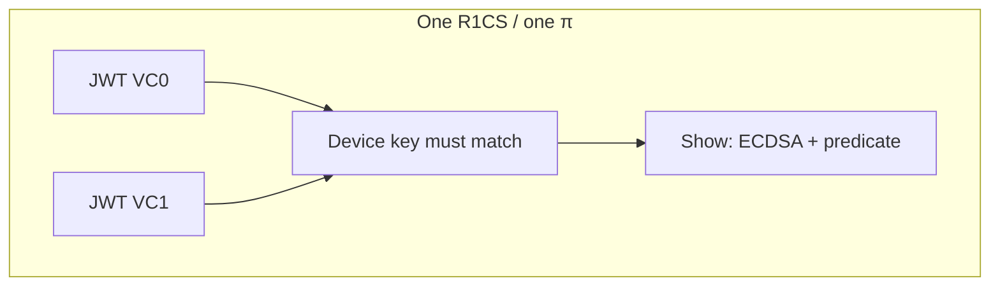

# Monolithic 2× SD-JWT + Show (Option 1)

**Branch:** `feature/monolithic-2vc-option1` in repo `zkID-miha`.

This note describes what changed relative to the existing **Prepare + Show** wallet flow, where the code lives, and what is still required for a full end-to-end build.

Design background (multi-VC options, Prepare/Show linking) is in [`MULTI_VC_PLAN.md`](../zkID-Claude/MULTI_VC_PLAN.md) when your **`zkID-Claude`** clone sits next to this repo (e.g. `csp/zkID-Claude/…`). If you only have **`zkID-miha`**, open that file from a `zkID-Claude` checkout in the editor or add the same doc to this tree.

**Track A vs Option 1 (diagrams, CLI snippets, branch table):** [`MULTI_VC_OPTIONS_VISUAL.md`](MULTI_VC_OPTIONS_VISUAL.md) in the same directory — on branch `feature/track-a-option2-2vc` in both **`zkID-miha`** and **`zkID-Claude`**.

---

## Intuition — why “monolithic” is different

**Verifier’s view (today, single VC).** They receive two proofs and check that the Pedersen commitment to the “shared” part of the witness is identical in both. That slice is small: device coordinates plus the few normalized scalar claims you expose to Show.

**Verifier’s view (Option 1).** They receive **one** proof. The statement is larger: “both SD-JWTs verify, both extract the same device key, and Show’s ECDSA + predicate are satisfied **in the same constraint system**.” There is nothing to “glue” across proofs because there is only one proof.



**Holder’s view.** You no longer run `generate_shared_blinds` / `reblind_prepare` / `reblind_show` for this path: every session is a single prove from a single witness file. The cost is that **any** change to either credential or the predicate touches the **same** large circuit, so you cannot reuse an old Prepare proof while only refreshing Show.

---

## Before (status quo)

- **Two circuits:** **Prepare** (per-credential SD-JWT verification and claim normalization) and **Show** (device ECDSA over verifier challenge + predicate over claims).
- **Two Spartan proofs** per presentation, linked by a **shared witness commitment** (`comm_W_shared`): the holder aligns blinds across proofs so the verifier checks the same device key and claim slice in both.
- **CLI / crates:** `prepare` and `show` subcommands in [`ecdsa-spartan2/src/main.rs`](ecdsa-spartan2/src/main.rs); [`PrepareCircuit`](ecdsa-spartan2/src/circuits/prepare_circuit.rs) and [`ShowCircuit`](ecdsa-spartan2/src/circuits/show_circuit.rs) (paths adjacent under `src/circuits/`).
- **SDK:** typically two proof stages and shared-blind handling (not replaced here for the legacy path).

---

## After (Option 1 — monolithic multi-VC)

- **One Circom R1CS** that inlines **two** SD-JWT paths (reuse of the existing `JWT` template) **and** one `Show` over the **concatenated** normalized claims (`vc0` claims then `vc1` claims).
- **Single Spartan proof** — no Prepare/Show split and **no** `comm_W_shared` for this path.
- **Device binding:** both JWT subcircuits expose `KeyBinding` coordinates; they are **constrained equal** to the public device key inputs consumed by `Show` (see equality constraints in [`circuits/monolithic_2sdjwt_show.circom`](circom/circuits/monolithic_2sdjwt_show.circom) around `deviceKeyX === j0.KeyBindingX` / `j1`).
- **Sizes:** `mono_2vc_1k`, `mono_2vc_2k`, `mono_2vc_4k`, `mono_2vc_8k` — JWT message bounds follow the existing `1k`/`2k`/… family; Show uses a doubled claim count (`nClaimsMono = 2 * maxClaims`).

### Circom

| Artifact | Path |
|----------|------|
| Template `Monolithic2SdJwtShow` | [`circuits/monolithic_2sdjwt_show.circom`](circom/circuits/monolithic_2sdjwt_show.circom) |
| Entry mains | [`circuits/main/mono_2vc_1k.circom`](circom/circuits/main/mono_2vc_1k.circom) … [`mono_2vc_8k.circom`](circom/circuits/main/mono_2vc_8k.circom) |
| Circuit params | [`circuits.json`](circom/circuits.json) keys `mono_2vc_*` |
| Compile script | [`scripts/compile.sh`](circom/scripts/compile.sh), npm scripts in [`package.json`](circom/package.json) |
| Generated sample inputs (gitignored) | [`src/generate-inputs.ts`](circom/src/generate-inputs.ts) → `inputs/mono_2vc/<size>/default.json`; ignore rule in [`circom/.gitignore`](circom/.gitignore) |

### Rust (`ecdsa-spartan2`)

| Concern | Path |
|---------|------|
| Circuit name per size | [`src/circuit_size.rs`](ecdsa-spartan2/src/circuit_size.rs) — `monolithic_circuit_name()` |
| R1CS / input paths | [`src/paths.rs`](ecdsa-spartan2/src/paths.rs) — `r1cs_path_mono_2vc()`, `input_mono_2vc_json()`, key filenames `MONO_2VC_*` |
| Witness + `SpartanCircuit` impl | [`src/circuits/monolithic_circuit.rs`](ecdsa-spartan2/src/circuits/monolithic_circuit.rs) |
| Nested JSON parsing | [`src/utils.rs`](ecdsa-spartan2/src/utils.rs) — `parse_mono_2vc_inputs`, `hashmap_to_json_string_mono_2vc` |
| Conditional C++ witness modules | [`build.rs`](ecdsa-spartan2/build.rs) — `has_circuit_mono_2vc_*` when `build/cpp/mono_2vc_*.cpp` exists |
| CLI `mono2vc` | [`src/main.rs`](ecdsa-spartan2/src/main.rs) — `CircuitKind::Monolithic2Vc`, `execute_monolithic_2vc` (no reblind / shared blinds) |
| Public API | [`src/lib.rs`](ecdsa-spartan2/src/lib.rs) — exports `Monolithic2VcCircuit`, `generate_mono_2vc_witness`, `parse_mono_2vc_inputs` |

### TypeScript SDK (`openac-sdk`)

| Concern | Path |
|---------|------|
| Flat witness layout from two JWT + Show inputs | [`src/inputs/mono-2vc-input-builder.ts`](openac-sdk/src/inputs/mono-2vc-input-builder.ts) |
| Witness WASM loading | [`src/witness-calculator.ts`](openac-sdk/src/witness-calculator.ts) — `mono_2vc_${vcSize}.wasm` under `assetsDir` |
| WASM precompute hook | [`src/wasm-bridge.ts`](openac-sdk/src/wasm-bridge.ts) — `precomputeMono2VcFromWitness` |
| Prove / verify | [`src/prover.ts`](openac-sdk/src/prover.ts) `proveMonolithic2Vc`, [`src/verifier.ts`](openac-sdk/src/verifier.ts) `verifyMonolithic2Vc` |
| Types | [`src/types.ts`](openac-sdk/src/types.ts) — `MonolithicVcSize`, `Monolithic2VcProofRequest`, etc. |
| Facade | [`src/index.ts`](openac-sdk/src/index.ts) — `OpenAC.proveMonolithic2Vc`, `verifyMonolithic2Vc` |

### WASM crate (for browser / TS)

| Concern | Path |
|---------|------|
| Export | [`wasm/src/lib.rs`](openac-sdk/wasm/src/lib.rs) — `precompute_mono_2vc_from_witness` |

---

## What still needs to be done

1. **Circom toolchain on secq256r1**  
   Local environments must use a Circom build that accepts the project’s curve (“invalid prime” errors indicate a mismatched Circom). After that, run [`circom/scripts/compile.sh`](circom/scripts/compile.sh) (or `npm run compile:all`) to produce `build/r1cs`, `build/cpp`, and WASM.

2. **Check in or copy `mono_2vc_*.wasm` into SDK assets**  
   [`witness-calculator.ts`](openac-sdk/src/witness-calculator.ts) expects files such as `assets/mono_2vc_1k.wasm` relative to `assetsDir`. The compile pipeline should copy Circom `--wasm` outputs into [`openac-sdk/assets/`](openac-sdk/assets/) (or document the path your app uses).

3. **Rebuild `openac-sdk/wasm` and refresh `pkg/`**  
   Run the project’s WASM build (e.g. `npm run build:wasm` from `openac-sdk`) so [`wasm-bridge.ts`](openac-sdk/src/wasm-bridge.ts) can import [`wasm/pkg/openac_wasm.js`](openac-sdk/wasm/pkg/openac_wasm.js) and the export `precompute_mono_2vc_from_witness` exists. Until then, `tsc --noEmit` fails on the missing generated module.

4. **`cargo build` with `native-witness`**  
   Requires generated [`wallet-unit-poc/circom/build/cpp/mono_2vc_*.cpp`](wallet-unit-poc/circom/build/cpp) from Circom. Without them, use `--no-default-features` or build only after compile.

5. **Integration tests**  
   Add a small vitest (or CLI) path that loads keys + witness for one size and runs `proveMonolithic2Vc` / verify, once artifacts exist.

6. **Optional ergonomics**  
   Helper to load `mono2vc` proving/verifying keys mirroring existing `LoadKeys` patterns; document env vars / file names under `keys/<size>/` next to [`paths.rs`](ecdsa-spartan2/src/paths.rs) `MONO_2VC_*` constants.

---

## Quick CLI reference (Rust)

After keys and witness inputs exist:

```text
cargo run --release -- mono2vc setup --size 2k
cargo run --release -- mono2vc prove --size 2k
cargo run --release -- mono2vc verify --size 2k
```

Input JSON: nested `vc0` / `vc1` plus shared Show/predicate fields, as parsed in [`utils.rs`](ecdsa-spartan2/src/utils.rs) `parse_mono_2vc_inputs`.
