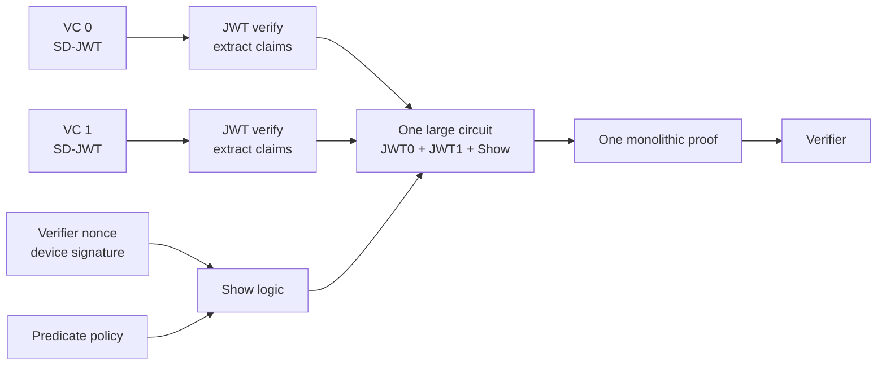
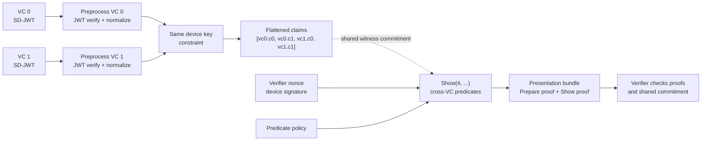

# Multi-VC Option 2 Implementation Plan

Source analyzed: https://hackmd.io/@vplasencia/H1dXriETbx

This plan starts from `origin/main`, not from the existing feature branches. The older
Option 1 and Option 2 branches are useful as prototypes, but the plan below is based on
the clean baseline and the current circuit/SDK contracts.

## Decision

Implement **Option 2: per-credential preprocessing plus one Show circuit over a
unified claim namespace**.

For this repository, the most natural shape is:

1. A multi-credential Prepare circuit verifies each SD-JWT separately, extracts
   normalized claims, and enforces that all credentials contain the same device
   binding key.
2. A size-specific Show circuit evaluates predicates over the flattened claim
   array, for example:
   - VC0 claim 0 -> `claimValues[0]`
   - VC0 claim 1 -> `claimValues[1]`
   - VC1 claim 0 -> `claimValues[2]`
   - VC1 claim 1 -> `claimValues[3]`
3. Spartan2 links Prepare and Show through the existing shared witness commitment:
   `[KeyBindingX, KeyBindingY, flattenedClaimValues...]`.

This keeps the current two-stage OpenAC model: heavy credential preprocessing can
be done before the verifier session, while Show stays tied to the verifier nonce.

## Baseline Findings

Clean `origin/main` currently has:

| Area | Current State | Relevance |
| --- | --- | --- |
| Circom `JWT` | Verifies one ES256 SD-JWT, extracts `normalizedClaimValues[maxMatches - 2]`, `KeyBindingX`, `KeyBindingY`. | This is already the per-credential preprocessor needed by Option 2. |
| Circom `Show` | Verifies device signature and evaluates generalized predicates over `claimValues[nClaims]`. | Already supports cross-claim predicates if `nClaims` is widened. |
| Shared layout | Prepare and Show share `[KeyBindingX, KeyBindingY, claimValues...]`. | Option 2 only needs a longer claim slice. |
| SDK | Exposes single-credential `precompute`, `present`, and `createProof`. | Needs multi-credential request and proof APIs. |
| ABI consistency | Circom/Rust expect `predicateRhsIsRef` + `predicateRhsValues`; part of the SDK still uses `predicateCompareValues`. | Must be fixed before multi-VC work, or tests will hide real failures. |
| Existing branches | Prototypes exist for monolithic 2VC and prepare/show 2VC. | Do not copy blindly; use only to sanity-check naming and rough surface area. |

## Visual Comparison

### Option 1: Monolithic 2VC



### Option 2: Per-VC Preprocess + Unified Show



### Tradeoff Matrix

| Dimension | Option 1: Monolithic | Option 2: Per-VC Preprocess |
| --- | --- | --- |
| Product fit | Works for a fixed 2VC demo, but mixes credential parsing and presentation policy in one circuit. | Matches the existing Prepare/Show architecture. |
| Per-session cost | High: verifier nonce is inside the large circuit, so the whole proof is session-bound. | Lower per-session work: heavy Prepare can be cached; Show remains nonce-bound. |
| Total prover work | Roughly two JWT paths plus one device-signature Show path. | Same cryptographic work class; usually better phase separation. |
| Peak memory | Largest circuit contains everything. | Multi-VC Prepare is still large, but Show stays separate and small. |
| Extensibility | Every new credential format bloats the top-level circuit. | Add preprocessors per credential format, keep Show over normalized claims. |
| Cross-VC predicates | Direct over internal flattened claims. | Direct over shared flattened claims. |
| Key management | One monolithic key family per VC count and size. | Separate multi-Prepare and widened-Show keys per VC count and size. |
| Best use | Fast proof-of-concept for exactly two credentials. | Production path for small fixed N, and a stepping stone to recursion/folding later. |

## Target V1 Scope

Implement fixed **2VC support** first.

Parameters:

| Name | Value |
| --- | --- |
| `VC_COUNT` | `2` |
| `CLAIMS_PER_VC` | `maxMatches - 2` |
| `SHOW_N_CLAIMS` | `VC_COUNT * CLAIMS_PER_VC` |
| Initial `maxMatches` | `4`, matching current JWT sizes |
| Initial Show shape | `Show(4, 2, 8, 64)` |

The implementation should avoid hard-coding assumptions outside the 2VC wrapper
where possible, so `3VC` and `4VC` variants are mechanical later.

## Implementation Plan

### 1. Stabilize the Show ABI

Before adding multi-credential code, make the single-credential Show contract
consistent across Circom, Rust, SDK, tests, and generated fixtures.

- Replace SDK-facing `predicateCompareValues` with:
  - `predicateRhsIsRef`
  - `predicateRhsValues`
- Keep a temporary compatibility alias in TypeScript only if existing demos need it.
- Update `ShowCircuitInputs`, `buildShowCircuitInputs`, tests, README snippets, and fixtures.
- Add tests for claim-to-claim predicates:
  - `claim[0] == claim[1]`
  - `claim[0] <= literal`
  - inactive predicate slots do not constrain bogus refs.

Acceptance:

- `Show` witness generation succeeds from SDK-built inputs.
- Circom tests cover RHS references.
- Rust `parse_show_inputs` and TypeScript inputs use the same field names.

### 2. Add the 2VC Prepare Circuit

Create a semantic wrapper around two existing `JWT` preprocessors.

Files to add/update:

- `wallet-unit-poc/circom/circuits/prepare_2sdjwt.circom`
- `wallet-unit-poc/circom/circuits/main/prepare_2vc_1k.circom`
- `wallet-unit-poc/circom/circuits/main/prepare_2vc_2k.circom`
- `wallet-unit-poc/circom/circuits/main/prepare_2vc_4k.circom`
- `wallet-unit-poc/circom/circuits/main/prepare_2vc_8k.circom`
- `wallet-unit-poc/circom/circuits.json`
- `wallet-unit-poc/circom/package.json`
- `wallet-unit-poc/circom/scripts/compile.sh`

Circuit behavior:

- Instantiate `JWT(...)` twice.
- Use distinct inputs for each credential slot: `message0`, `message1`, etc.
- Constrain:
  - `jwt0.KeyBindingX === jwt1.KeyBindingX`
  - `jwt0.KeyBindingY === jwt1.KeyBindingY`
- Output:
  - `normalizedClaimValuesAll[0..3]`
  - `KeyBindingX`
  - `KeyBindingY`

Claim ordering:

```text
normalizedClaimValuesAll[0] = VC0 claim 0
normalizedClaimValuesAll[1] = VC0 claim 1
normalizedClaimValuesAll[2] = VC1 claim 0
normalizedClaimValuesAll[3] = VC1 claim 1
```

Acceptance:

- Same-device 2VC fixture passes.
- Different-device 2VC fixture fails constraints.
- Public-output witness layout is documented and tested.

### 3. Add the 2VC Show Variant

Reuse the generic `Show` template with a wider claim array.

Files to add/update:

- `wallet-unit-poc/circom/circuits/main/show_2vc.circom`
- `wallet-unit-poc/circom/circuits.json`
- compile scripts and input fixtures.

Initial wrapper:

```circom
component main {public [deviceKeyX, deviceKeyY]} = Show(4, 2, 8, 64);
```

Acceptance:

- `Show(4, ...)` proves a predicate on VC0 and VC1 claims.
- Cross-VC predicate test passes, for example `vc0.claim1 == vc1.claim0`.
- Shared witness order matches `Prepare2SdJwt`.

### 4. Generate 2VC Inputs and Fixtures

Extend input generation without changing the single-credential output format.

Files to update:

- `wallet-unit-poc/circom/src/generate-inputs.ts`
- `wallet-unit-poc/circom/src/mock-vc-generator.ts`
- `wallet-unit-poc/circom/inputs/prepare_2vc/.../default.json`
- `wallet-unit-poc/circom/inputs/show_2vc/.../default.json`

Fixture requirements:

- Two SD-JWTs with the same `cnf.jwk`.
- Independent issuer keys should be supported, even if the first fixture reuses one issuer.
- At least one policy that references both credentials.
- Explicit `decodeFlags` and `claimFormats` per credential.

Acceptance:

- `yarn generate:inputs --size 1k` writes both single-VC and 2VC inputs.
- Generated 2VC inputs pass Circom witness generation.

### 5. Add Spartan2/Rust Circuit Bindings

Add native circuit wrappers that mirror the existing `PrepareCircuit` and
`ShowCircuit`.

Files to update:

- `wallet-unit-poc/ecdsa-spartan2/build.rs`
- `wallet-unit-poc/ecdsa-spartan2/src/circuit_size.rs`
- `wallet-unit-poc/ecdsa-spartan2/src/circuits/mod.rs`
- `wallet-unit-poc/ecdsa-spartan2/src/circuits/prepare_2vc_circuit.rs`
- `wallet-unit-poc/ecdsa-spartan2/src/circuits/show_2vc_circuit.rs`
- `wallet-unit-poc/ecdsa-spartan2/src/paths.rs`
- `wallet-unit-poc/ecdsa-spartan2/src/utils.rs`
- `wallet-unit-poc/ecdsa-spartan2/src/main.rs`

Required pieces:

- Witnesscalc adapters for `prepare_2vc_1k`, `prepare_2vc_2k`,
  `prepare_2vc_4k`, `prepare_2vc_8k`, and `show_2vc`.
- Output layout for `Prepare2SdJwt`:
  - witness `1..4`: flattened claims
  - then `KeyBindingX`, `KeyBindingY`
- Shared layout for both circuits:
  - `[KeyBindingX, KeyBindingY, claim0, claim1, claim2, claim3]`
- Separate key names for multi-VC circuits, for example:
  - `1k_prepare_2vc_proving.key`
  - `1k_prepare_2vc_verifying.key`
  - `1k_show_2vc_proving.key`
  - `1k_show_2vc_verifying.key`

Acceptance:

- Native setup/prove/verify works for 1k.
- Shared commitment mismatch fails when Show claim values do not match Prepare outputs.
- Benchmarks report single-VC, Option 1 prototype, and Option 2 timings when keys exist.

### 6. Add SDK Multi-VC API

Keep the single-VC API stable and add explicit multi-VC entry points.

Suggested API:

```ts
const precomputed = await openac.precomputeMulti({
  credentials: [
    { jwt, disclosures, issuerPublicKey, decodeFlags, claimFormats },
    { jwt, disclosures, issuerPublicKey, decodeFlags, claimFormats },
  ],
  keys,
  jwtParams,
});

const proof = await openac.presentMulti({
  precomputed,
  verifierNonce,
  devicePrivateKey,
  keys,
  showInputOptions: {
    predicates: [
      { claimRef: 0, op: PredicateOp.LE, rhsIsRef: false, rhsValue: 970331n },
      { claimRef: 2, op: PredicateOp.EQ, rhsIsRef: true, rhsValue: 1n },
    ],
    logicExpression: [
      { type: LogicToken.REF, value: 0 },
      { type: LogicToken.REF, value: 1 },
      { type: LogicToken.AND, value: 0 },
    ],
  },
});
```

Files to update:

- `wallet-unit-poc/openac-sdk/src/types.ts`
- `wallet-unit-poc/openac-sdk/src/prover.ts`
- `wallet-unit-poc/openac-sdk/src/inputs/jwt-input-builder.ts`
- `wallet-unit-poc/openac-sdk/src/inputs/show-input-builder.ts`
- `wallet-unit-poc/openac-sdk/src/witness-calculator.ts`
- `wallet-unit-poc/openac-sdk/src/wasm-bridge.ts`
- `wallet-unit-poc/openac-sdk/src/verifier.ts`
- `wallet-unit-poc/openac-sdk/src/index.ts`

SDK responsibilities:

- Parse each credential independently.
- Fail early if device binding keys differ.
- Build nested or flat `prepare_2vc` input deterministically.
- Extract normalized values from the Prepare witness for Show input construction.
- Track claim namespace metadata in the precomputed object.
- Serialize proof bundles with a proof kind/version so verifiers load the right keys.

Acceptance:

- `precomputeMulti` caches the heavy 2VC Prepare proof/witness.
- `presentMulti` builds Show inputs from the prepared flattened values by default.
- User-supplied claim values cannot silently diverge from Prepare outputs.
- `verifyProof` can distinguish single-VC and 2VC proof bundles.

### 7. Add WASM/Mobile Support

The browser/mobile path needs named witness calculators and WASM exports for the
new circuits.

Files to update:

- `wallet-unit-poc/openac-sdk/wasm/src/lib.rs`
- `wallet-unit-poc/openac-sdk/scripts/build-wasm.sh`
- `wallet-unit-poc/mobile/...` asset copy and binding paths as needed.

Acceptance:

- Browser witness generation supports `prepare_2vc` and `show_2vc`.
- Mobile assets are named unambiguously and do not overwrite single-VC assets.
- Memory behavior is measured on at least the 1k and 2k variants.

### 8. Tests and Benchmarks

Minimum test set:

| Layer | Tests |
| --- | --- |
| Circom | Same-device 2VC passes; different-device 2VC fails; output ordering; cross-VC predicate. |
| Rust | Parse nested inputs; witness layout; shared commitment equality and mismatch. |
| SDK | Build two credentials; precompute/present/verify; serialization; wrong key family fails. |
| WASM | Witness generation for `prepare_2vc` and `show_2vc`. |
| Benchmarks | Compare single-VC, Option 1 2VC, and Option 2 2VC for prove time, peak memory, proof size, and key size. |

Benchmark table to produce:

| Variant | Prepare prove | Show prove | Total prove | Peak memory | Proof bundle | Key size |
| --- | ---: | ---: | ---: | ---: | ---: | ---: |
| Single VC | TBD | TBD | TBD | TBD | TBD | TBD |
| Option 1 2VC | TBD | n/a | TBD | TBD | TBD | TBD |
| Option 2 2VC | TBD | TBD | TBD | TBD | TBD | TBD |

## Implementation Order

1. Show ABI cleanup and tests.
2. Circom `Prepare2SdJwt` and `show_2vc` wrappers.
3. Fixture generation for 2VC.
4. Rust circuit bindings and CLI/key paths.
5. SDK multi-VC types, input builders, and proof APIs.
6. WASM/mobile bindings.
7. Benchmarks and documentation.

## Open Questions

1. Does the product require a literally single proof object, or is the current
   OpenAC proof bundle acceptable as "one presentation"? This plan assumes the
   current bundle model.
2. Should `deviceKeyX` and `deviceKeyY` remain public for 2VC, matching current
   Show behavior, or should a later privacy pass hide/rotate this differently?
3. Should V1 support exactly two credentials, or support `maxCredentials = 2`
   with inactive slots?
4. Should the verifier receive claim namespace metadata, a policy hash, or both?
5. Are mixed credential formats in V1 required, or is SD-JWT-only sufficient for
   the first implementation?

## Done Definition

Option 2 is done when:

- A 2VC proof can be generated and verified end-to-end from TypeScript.
- Both credentials are issuer-verified in circuit.
- Both credentials are constrained to the same device binding key.
- Show evaluates a predicate that references both credentials.
- Prepare and Show are linked by the shared witness commitment.
- Single-VC APIs and tests continue to work.
- Benchmarks clearly compare Option 1 and Option 2.
