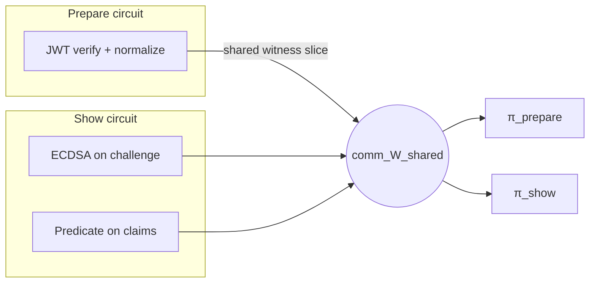
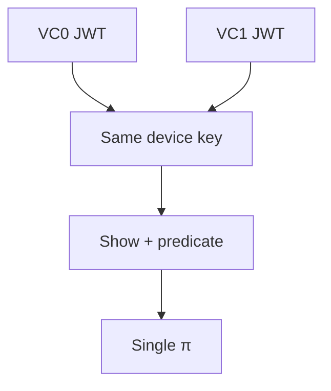
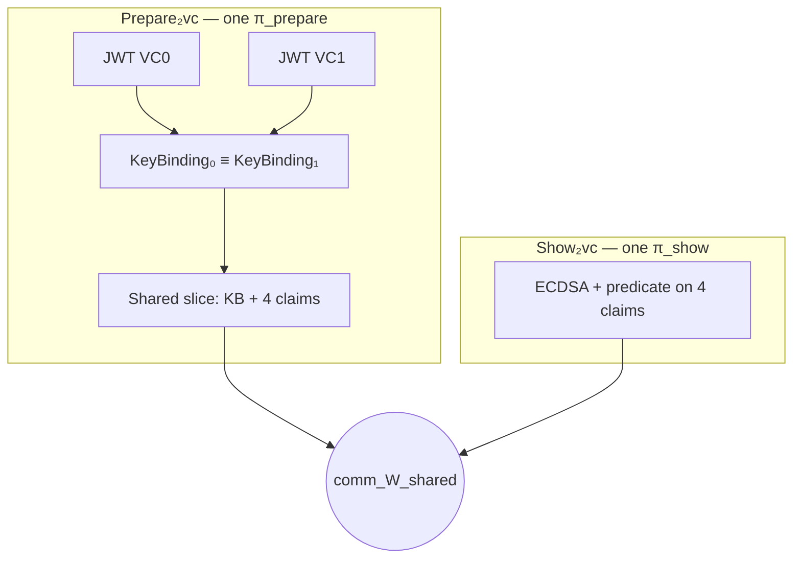
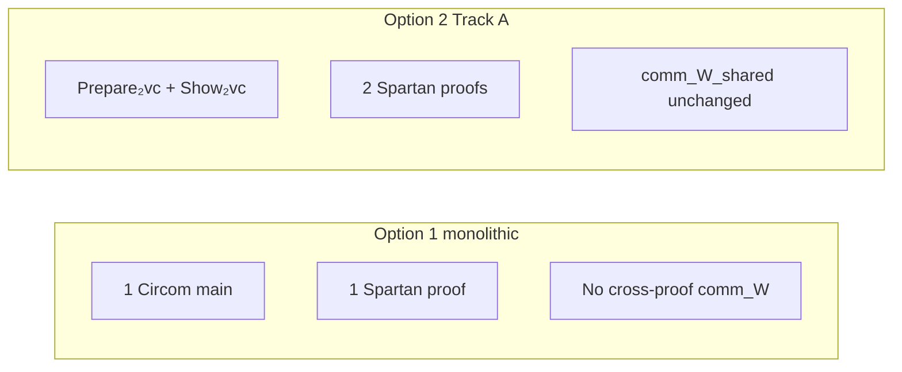

# Multi-VC options: Option 1 vs Track A Option 2

This document answers three things in one place:

1. **Richer intuition** for what changed from classic single-VC Prepare/Show.
2. **What lives on which branch** in this repo family.
3. **Side-by-side comparison** with diagrams and small code excerpts (Circom + Rust CLI).

The product design context is in the repo-root note [`MULTI_VC_PLAN.md`](../MULTI_VC_PLAN.md) (§3 design space, §4 Track A).

---

## 1. Classic single-VC baseline (before any multi-VC work)

**Story.** The wallet proves: (a) the issuer signed an SD-JWT, (b) the holder’s device key is bound in that JWT, and (c) the holder signs the verifier’s challenge and a predicate holds on normalized claims.

**Architecture — two Spartan proofs, one Pedersen link.**



**Circom today (one credential).** Prepare is a single `JWT` template; Show is `Show(nClaims, …)` with `nClaims = maxMatches - 2`:

```circom
// circuits/main/jwt_1k.circom (conceptually)
component main = JWT(1280, 960, 4, 50, 128);

// circuits/main/show.circom
component main {public [deviceKeyX, deviceKeyY]} = Show(2, 2, 8, 64);
```

**Rust shared slice (unchanged idea).** Both `PrepareCircuit::shared` and `ShowCircuit::shared` expose the same tuple: device key coordinates + flat normalized claim values, so Spartan can commit once and verify equality across proofs (`ecdsa-spartan2/src/circuits/prepare_circuit.rs` and `show_circuit.rs`).

---

## 2. Option 1 — monolithic single proof (branch on `zkID-miha`)

**Branch:** `feature/monolithic-2vc-option1` (primary implementation; Option 1 sources may also be merged or mirrored in other checkouts).

**Story.** One Circom program runs **two** SD-JWT paths **and** the Show gadget. The device key is wired so both JWT `KeyBinding` outputs **must** match the Show public key inputs. One R1CS, **one** Spartan proof — **no** `comm_W_shared` between separate proofs.



**Circom shape (excerpt).** Two `JWT` instances + equalities + `Show` over `2 * maxClaims` inputs:

```circom
deviceKeyX === j0.KeyBindingX;
deviceKeyY === j0.KeyBindingY;
deviceKeyX === j1.KeyBindingX;
deviceKeyY === j1.KeyBindingY;

component sh = Show(nClaimsMono, maxPredicates, maxLogicTokens, valueBits);
// … wire claimValues from j0 then j1 …
```

**Trade-offs (plain language).**

| Pros | Cons |
|------|------|
| Verifier handles one proof artifact | Larger single R1CS; cannot ship Prepare-only early |
| No shared-blind / reblind choreography | Any credential update forces full re-prove |

**Where to read more.** Option 1 file layout and TODOs: [`MONOLITHIC_2VC.md`](MONOLITHIC_2VC.md) (same folder as this document — present on this branch in both `zkID-miha` and `zkID-Claude` when the branch is checked out in each clone).

---

## 3. Track A Option 2 — still two proofs, wider shared slice (this branch)

**Branch:** `feature/track-a-option2-2vc` in **`zkID-miha`** and **`zkID-Claude`** (keep these clones in sync from the same remote or `git fetch` / `git pull` between the two local paths; recommended primary workspace: **`zkID-miha`** to avoid duplicating work across two roots).

**Story.** Keep the **Prepare / Show split** and **`comm_W_shared`** exactly as in production today. Extend Prepare so it runs **two** SD-JWT templates in one Prepare R1CS; extend Show to `Show(4, …)` so the flat claim vector is **VC0 claims ∥ VC1 claims**. Same device key is enforced **inside** Prepare (both JWT paths agree on `KeyBinding`).



**Circom added here.**

| Role | File |
|------|------|
| Dual Prepare | [`circom/circuits/prepare_2sdjwt.circom`](circom/circuits/prepare_2sdjwt.circom) |
| Sized mains | [`circom/circuits/main/prepare_2vc_1k.circom`](circom/circuits/main/prepare_2vc_1k.circom) … `prepare_2vc_8k.circom` |
| Show(4,…) main | [`circom/circuits/main/show_2vc.circom`](circom/circuits/main/show_2vc.circom) |

**Public output order for Prepare₂vc** (for Rust witness layout) is intentionally aligned with the single-JWT pattern, but with **four** claim outputs first, then keybinding — see `calculate_prepare_2vc_output_indices` in `ecdsa-spartan2/src/utils.rs`.

**Rust / CLI.**

| Piece | Location |
|-------|----------|
| `Prepare2VcCircuit` | `ecdsa-spartan2/src/circuits/prepare_2vc_circuit.rs` |
| `Show2VcCircuit` | `ecdsa-spartan2/src/circuits/show_2vc_circuit.rs` |
| CLI verbs | `prepare2vc …`, `show2vc …` in `ecdsa-spartan2/src/main.rs` |
| Keys on disk | `prepare_2vc_proving.key`, `show_2vc_proving.key`, … under `keys/<size>_…` |

**Fixture JSON.**

- Prepare: `inputs/prepare_2vc/<size>/default.json` — `{ "vc0": {…jwt…}, "vc1": {…jwt…} }` (same device binding; see `generate-inputs.ts`).
- Show: `inputs/show_2vc/<size>/default.json` — `Show(4,2,8,64)`-shaped inputs.

---

## 4. “Before / after” at the code level

### 4.1 Prepare: one JWT → two JWTs

**Before (single VC).**

```circom
component main = JWT(1280, 960, 4, 50, 128);
```

**After (Track A Prepare₂vc).**

```circom
component j0 = JWT(...);
component j1 = JWT(...);
j0.KeyBindingX === j1.KeyBindingX;
j0.KeyBindingY === j1.KeyBindingY;
signal output normalizedClaimValuesAll[2 * maxClaims];
// …
```

### 4.2 Show: two claim slots → four

**Before.**

```circom
component main {public [deviceKeyX, deviceKeyY]} = Show(2, 2, 8, 64);
```

**After.**

```circom
component main {public [deviceKeyX, deviceKeyY]} = Show(4, 2, 8, 64);
```

### 4.3 Rust CLI

**Before.**

```text
cargo run --release -- prepare prove --size 1k
cargo run --release -- show    prove --size 1k
```

**After (Track A).**

```text
cargo run --release -- prepare2vc prove --size 1k
cargo run --release -- show2vc    prove --size 1k
```

(You still generate `shared_blinds.bin` from the **prepare** side of the flow — here `prepare2vc generate_shared_blinds` mirrors the old `prepare` command.)

---

## 5. Option 1 vs Option 2 — decision matrix



| Dimension | Option 1 (monolithic) | Option 2 (Track A, this branch) |
|-----------|------------------------|----------------------------------|
| Number of Spartan proofs | 1 | 2 (Prepare + Show) |
| `comm_W_shared` | Not used between proofs | Still the linking mechanism |
| Circom mains | `mono_2vc_*` (+ combined Show) | `prepare_2vc_*` + `show_2vc` |
| Verifier delta | New “mono” proof type | Same two-proof API, wider vectors |
| Holder flow | Single witness + prove | Shared blinds + prove/reblind as today |
| Fits §4.6 diagram in `MULTI_VC_PLAN.md` | No (single π) | Yes |

---

## 6. What is still TODO on this branch

1. **Compile with Circom ≥ 2.2.3 and `secq256r1`** (the project prime in `circomkit.json`). Stock Circom 2.1.x rejects that prime; upgrade the compiler in CI and locally.
2. **Run** `npm run compile:all` (or individual `compile:prepare_2vc:*` + `compile:show_2vc`) so `build/cpp/prepare_2vc_*.cpp` and `show_2vc.cpp` exist — then rebuild `ecdsa-spartan2` **with** `--features native-witness`.
3. **End-to-end test** the two-proof pipeline (generate blinds → prove prepare2vc → reblind → prove show2vc → verify both) analogous to `run_prove_pipeline` for single VC.
4. **`openac-sdk`** Track A API (dual JWT inputs, `show_2vc` WASM asset) — not wired in this changeset.

---

## 7. Git branches (summary)

| Branch | Repos (use one primary clone) | Option |
|--------|-------------------------------|--------|
| `feature/monolithic-2vc-option1` | `zkID-miha` (and any fork that carried the work) | Option 1 |
| `feature/track-a-option2-2vc` | **`zkID-miha`**, `zkID-Claude` | Track A §4 (Option 2) |

To compare locally: check out each branch side by side and diff `wallet-unit-poc/circom` + `wallet-unit-poc/ecdsa-spartan2`.
